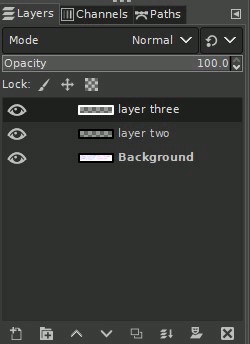
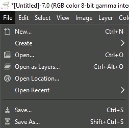

<!--
! PENDING COMPLETION
! more usage, testing required

TODO add better media / gifs
TODO add more steps and details
 -->

# Create a GIF with GIMP

Created: 2021/02/09 14:43:12  
Last modified: 2021/02/09 16:53:46

***\#GIMP \#images \#animation***

Most photo editing software can output .gifs by treating each **layer** of the image as a frame of the animation, and automatically loop through the frames.  The playback speed (framerate) can be controlled by changing the duration of each frame.

Blank or transparent layers can be added manually and edited in GIMP or external images imported as layers. This method is good for simple GIFs or low frame-rates but, can be difficult to manage the timing of object movement during playback due to constant duration between frames. 

A reliable way to recreate the realistic timing and movement in a GIF is to capture the content with screen capture software as a video. Using the frames of this video will preserve the movement and timing.

---
## METHOD 1: Add layers manually

This method requires that we manually add each frame of the animation as a layer in GIMP.

Or we can use other source images by importing each image as a layer in the appropriate order.

## METHOD 2: Convert video to GIF directly

*GIF: drawing in GIMP, recorded with OBS, exported as GIF with Shotcut*
<!--! make smaller : 1000x200-->

Using video editing software, [Shotcut] in this case, you can easily edit and export a video as a GIF, as well as set a custom framerate.

<!-- ## Capture the content as a video

> A source video or video capture software is required for this step.  
> For this article I will be using this [video] at 1280 x 720.  
> Other free videos are available for download at [pixabay].  
> I would recommend [OBS-Studio] to record or stream your PC monitor - free and open source -->

---

## Related Articles

[premiumbeat.com](https://www.premiumbeat.com/blog/alternatives-to-premiere-pro-free-paid/) - Free / paid alternatives to Adobe Premiere

---

## Sources / Bibliography

Source | Description
-|-
| [it's FOSS](https://itsfoss.com/make-gif-in-gimp/) | Original article on GIFs with GIMP

<!-- Links used in this article ------------------------------->
[OBS-Studio]: https://obsproject.com/ "Open Broadcast Software Studio"
[video]: https://pixabay.com/videos/ocean-sunset-sea-beach-coast-62249/
[pixabay]: https://pixabay.com/
[shotcut]: https://shotcut.org/features/